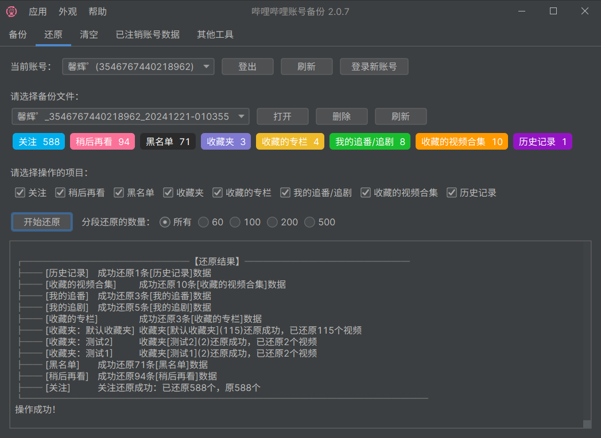

# 哔哩哔哩账号工具 macOS 整合版

这是一个面向 macOS 的 B 站账号数据工具整合仓库，包含两个可以独立运行、用途不同的桌面项目：

- [`bilibili-backup/`](./bilibili-backup/)：经典 Java/Swing 账号备份与迁移工具，基于 [hzhilong/bilibili-backup](https://github.com/hzhilong/bilibili-backup) 2.1.6，增加了 macOS 打包、网络兼容和关注列表同步等功能。
- [`bilitoolkit/`](./bilitoolkit/)：较新的 Electron/Vue 插件式工具箱，基于 [hzhilong/bilitoolkit](https://github.com/hzhilong/bilitoolkit)，通过安装插件扩展账号备份、每日任务、弹幕查询和图片下载等能力。

两个项目都来自开发者 `hzhilong` 的开源项目。本仓库不是原作者发布的官方 macOS 版本，而是在保留上游代码和许可证的基础上，对两个项目进行了 macOS 构建、启动和分发适配。

## 应该使用哪个项目

| 对比项 | Java 版 `bilibili-backup` | 新版 `BiliToolkit` |
| --- | --- | --- |
| 主要定位 | 账号数据备份、还原、清空和账号迁移 | 可安装插件的综合 B 站工具箱 |
| 界面技术 | Java 8 兼容代码、Swing、FlatLaf | Electron、Vue 3、TypeScript、Element Plus |
| 当前版本 | 上游 2.1.6 的 macOS 增强版 | 0.0.4 |
| 功能提供方式 | 功能直接内置在程序中 | 主程序提供账号和插件运行环境，具体功能由插件提供 |
| 多账号 | 支持保存和切换多个账号 | 支持多个账号，并可按插件选择执行账号 |
| 直接同步账号 | 支持，数据在内存中从基准账号传给目标账号 | 取决于已安装的备份插件能力 |
| 适合人群 | 主要目标是迁移旧账号数据，或需要本仓库新增的严格关注同步 | 希望长期使用多个 B 站工具并按需安装插件 |
| 数据目录 | `~/Library/Application Support/bilibili-backup` | Electron `userData` 目录，通常为 `~/Library/Application Support/BiliToolkit` |

如果你的主要目的就是把旧账号的关注、收藏夹、追番追剧和历史记录迁移到新账号，优先使用 Java 版。如果你希望使用插件市场、定时任务和更多后续插件，优先使用 BiliToolkit。两个程序可以同时安装，互不覆盖。

> [!IMPORTANT]
> 两个项目彼此独立，登录状态、Cookie、备份文件、插件和设置不会自动共享。不要把 BiliToolkit 当成 Java 版的升级安装包直接覆盖使用。

## 项目从何而来

### Java 版的来源

[hzhilong/bilibili-backup](https://github.com/hzhilong/bilibili-backup) 是原作者早期开发的 B 站账号备份与还原工具，核心用途是迁移账号数据或在清理旧账号前保存数据。上游 2.1.6 主要提供 Windows 分发，macOS 和 Linux 用户需要自行从源码编译。

原作者已经停止维护该项目，并将后续方向迁移到 BiliToolkit。本仓库保留 2.1.6 的 Java/Swing 实现，因为它的账号备份、还原和清空流程比较完整，同时针对 macOS 和实际迁移场景继续做了以下改进：

- 使用 `jpackage` 生成包含 Java runtime 的 `.app`，普通用户无需单独安装 Java。
- 增加 macOS 启动包装器，将工作目录切换到用户可写位置。
- 修复扫码登录时可能出现的 TLS `PKIX path building failed`。
- 增加 HTTP 超时配置和只读 GET 请求退避重试，缓解 `read timeout`。
- 关注失败疑似触发风控时等待 15 分钟，再重试当前关注操作。
- 增加严格同步关注列表、账号直连同步和一键取关已注销账号。

原项目说明保存在 [`UPSTREAM_README.md`](./UPSTREAM_README.md)，便于核对上游原始功能和注意事项。

### BiliToolkit 的来源

[hzhilong/bilitoolkit](https://github.com/hzhilong/bilitoolkit) 是原作者后续开发的“哔哩工具姬”。它不是把 Java 版界面换成 Electron，而是重新设计成一个插件宿主：主程序负责账号管理、插件安装、文件和数据库隔离、任务调度，具体业务功能由插件提供。

本仓库整合了 BiliToolkit 0.0.4 源码，并补充了以下 macOS 适配：

- 输出 Apple Silicon `arm64` 和 Intel `x64` 两种 DMG/ZIP。
- 生成 Retina `.icns` 图标并使用 macOS 应用分类。
- 调整默认窗口尺寸和高分屏显示。
- 修复生产包中本地插件页面的加载路径问题。
- 将生产环境数据写入 Electron `userData`，避免向只读 `.app` 内部写文件。
- 对打包后的应用进行临时签名并执行签名校验。

BiliToolkit 相关的上游模块还包括：

- [bili-api](https://github.com/hzhilong/bili-api)：B 站 API 客户端。
- [bilitoolkit-types](https://github.com/hzhilong/bilitoolkit-types)：插件类型定义。
- [bilitoolkit-runtime](https://github.com/hzhilong/bilitoolkit-runtime)：插件运行时。
- [bilitoolkit-ui](https://github.com/hzhilong/bilitoolkit-ui)：插件 UI 组件。
- [bilitoolkit-plugins](https://github.com/hzhilong/bilitoolkit-plugins)：官方和示例插件集合。

## 仓库结构

```text
.
├── README.md                  # 本说明
├── RELEASE_NOTES.md           # macOS 分发版本说明
├── UPSTREAM_README.md         # Java 上游项目原始 README
├── bilibili-backup/           # Java/Swing 账号备份项目
│   ├── pom.xml
│   ├── src/
│   ├── assets/
│   └── script/
└── bilitoolkit/               # Electron/Vue 插件工具箱
    ├── package.json
    ├── src/
    ├── public/
    ├── scripts/
    └── electron-builder.ts
```

## 界面预览

Java 版“哔哩哔哩账号备份”：



BiliToolkit“哔哩工具姬”：


## 下载和安装

请从本仓库的 [GitHub Releases](https://github.com/Anonymous0632/bilibili-backup-macos/releases) 下载，不要直接下载 GitHub 自动生成的 Source code 压缩包当作应用使用。

### Java 版

下载：

```text
bilibili-backup-macos-2.1.6.dmg
```

安装步骤：

1. 打开 DMG。
2. 将“哔哩哔哩账号备份.app”复制到“应用程序”目录。
3. 从“应用程序”中打开程序。
4. 首次打开后，在程序内扫码登录 B 站账号。

Java runtime 已包含在应用中，不需要安装 JDK 或 Maven。JDK 和 Maven 只在从源码构建时需要。

### BiliToolkit

Apple Silicon Mac（M 系列芯片）下载：

```text
BiliToolkit_0.0.4_arm64.dmg
```

Intel Mac 下载：

```text
BiliToolkit_0.0.4_x64.dmg
```

安装步骤：

1. 根据 Mac 芯片选择对应 DMG。
2. 打开 DMG，将 `BiliToolkit.app` 复制到“应用程序”。
3. 打开 BiliToolkit。
4. 进入“账号管理”扫码登录。
5. 进入“插件市场”安装需要的插件。

Electron runtime 和 Node.js 运行环境已包含在应用中，普通使用不需要安装 Node.js 或 pnpm。

### 首次打开被 macOS 拦截

当前分发包使用临时签名，没有使用 Apple Developer ID 进行公证。部分 macOS 版本首次打开时可能提示无法验证开发者。

可以先在 Finder 中右键应用，选择“打开”；如果仍被拦截，再进入“系统设置 -> 隐私与安全性”，确认应用确实来自本仓库的 Release 后选择允许打开。不要对来源不明的同名应用这样操作。

## Java 版使用说明

### 登录账号

Java 版的大部分页面顶部都有账号选择器：

1. 点击“登录新账号”。
2. 使用哔哩哔哩手机客户端扫描二维码并确认登录。
3. 登录成功后，账号会出现在下拉列表中。
4. 需要迁移账号时，分别登录基准账号和目标账号。

账号登录信息保存在本机，不会写入 Git 仓库。请像保护浏览器登录状态一样保护程序数据目录。

### 备份

“备份”页用于把当前账号数据保存到本地：

1. 选择需要备份的账号。
2. 勾选需要备份的项目。
3. 数据量很大时，可以选择分段备份数量。
4. 点击“开始备份”，等待日志显示完成。

支持的主要项目包括：

- 关注和关注分组。
- 稍后再看。
- 黑名单。
- 收藏夹。
- 收藏的专栏。
- 我的追番/追剧。
- 收藏的视频合集。
- 历史记录。
- 粉丝。

粉丝数据只能备份，不能把其他账号的粉丝“还原”到新账号。

### 还原

“还原”页用于把已经保存到本地的备份写入当前账号：

1. 选择目标账号。
2. 选择本地备份目录。
3. 勾选需要还原的项目。
4. 确认目标账号和备份来源无误。
5. 点击“开始还原”。

默认情况下，还原会先读取目标账号现有数据，已经存在的内容会跳过。历史记录只有程序和当前 B 站接口能够识别的类型可以还原，失效视频、失效收藏和接口不支持的数据可能被跳过。

应用菜单中的“设置”提供以下还原选项：

- 还原失败时继续处理下一条数据。
- 忽略目标账号现有数据，直接执行还原。
- 严格同步关注列表。
- 收藏夹达到上限时保存到默认收藏夹。
- 手动选择关注分组或收藏夹。

### 同步账号

“同步账号”页把备份和还原合并成一个操作，不需要先生成本地备份：

1. 将拥有正确数据的账号选为“基准账号”。
2. 将需要接收数据的账号选为“目标账号”。
3. 选择关注、收藏夹、追番追剧、历史记录等同步项目。
4. 阅读确认框中的账号方向和取关提示。
5. 点击确认后等待同步完成。

每个项目从基准账号读取后，会通过内存立即交给目标账号还原，不会创建用于此次同步的本地备份目录。任务结束后，相应内存数据会被释放。

同步规则：

- 关注列表执行严格同步。基准账号关注、目标账号未关注的用户会被关注。
- 目标账号关注、基准账号未关注的用户会被取关。
- 如果基准账号关注列表为空，目标账号的全部关注都会被取关。
- 关注分组会按现有还原逻辑创建和迁移。
- 收藏夹、追番追剧、历史记录等其他项目沿用原来的增量还原逻辑，通常不会删除目标账号独有的数据。
- 粉丝不能还原，因此不会出现在同步项目中。

> [!CAUTION]
> “同步账号”不是双向合并。数据方向始终是“基准账号 -> 目标账号”，而且同步关注时会执行真实取关操作。该流程不生成回滚备份，建议重要账号先单独完成一次普通备份。

### 清空

“清空”页会删除当前账号中所选类型的数据。它适合在迁移完成后清理旧账号，但属于不可逆或难以撤销的操作。

执行前至少确认：

- 当前选中的确实是需要清理的账号。
- 需要保留的数据已有可读取的本地备份。
- 备份不是空目录，并且已经检查过备份数量。

### 已注销账号数据

“已注销账号数据”页用于查询和备份已经显示为“账号已注销”的账号所遗留的公开数据。能够获取的内容取决于 B 站接口当前仍然公开的信息，不能保证所有已注销账号都有完整结果。

### 其他工具

Java 版还内置了一组独立工具：

- 一键已读或删除私信。
- 删除系统通知。
- 开启或关闭私信自动回复。
- 备份视频弹幕并辅助反查发送者。
- 批量拷贝他人公开收藏夹。
- 移除疑似异常推广账号粉丝。
- 一键取关昵称为“账号已注销”的关注对象。
- 收藏指定用户的全部投稿。
- AI 转正答题。
- 清空“@ 我的”消息。
- 删除“回复我的”或“收到的赞”关联评论。

工具是否可用取决于 B 站接口、账号权限和风控状态。涉及删除、取关或批量操作的工具会直接修改账号数据。

“AI 转正答题”需要在应用设置中填写 API URL、API Key 和模型名称，请只使用你信任的模型服务，并自行确认请求内容和密钥处理方式。

### 风控、超时和重试

大量恢复关注可能触发 B 站风控。当前版本在关注操作遇到疑似风控、`read timeout` 或 HTTP 403/412/429 时，会暂停 15 分钟，然后重试当前用户。等待期间可以取消任务。

仍然建议：

- 新注册账号先正常使用一段时间并提升账号等级。
- 大批量迁移尽量分批执行。
- 不要同时运行多个会修改同一账号的工具。
- 日志出现持续失败时先停止，稍后再继续。

### Java 版数据位置

macOS App 的启动包装器会先切换到：

```text
~/Library/Application Support/bilibili-backup
```

主要数据通常包括：

```text
bin/cookies/     已登录账号信息
backup-data/     常规账号备份
backup-other/    其他工具产生的备份
bin/log/         运行日志
```

这项适配解决了 Finder 双击 `.app` 时工作目录不可写而导致的：

```text
java.io.IOException: Operation not permitted
Failed to launch JVM
```

卸载应用不会自动删除上述目录。需要彻底移除本地账号信息时，应先退出程序并自行备份或删除该目录。

## BiliToolkit 使用说明

### BiliToolkit 是什么

BiliToolkit 本身更像“工具箱操作系统”。主程序提供：

- 多账号登录和账号切换。
- 插件市场、安装、更新和卸载。
- 已安装插件管理和最近使用列表。
- 普通界面插件和定时任务插件运行环境。
- 插件之间隔离的文件与数据库目录。
- 任务配置、执行记录和日志。

安装主程序后还需要安装插件，才能获得具体的 B 站业务功能。

### 登录账号

1. 打开左侧“账号管理”。
2. 点击“登录新账号”。
3. 使用哔哩哔哩手机客户端扫码并确认。
4. 等待账号信息同步完成。

账号管理还支持手动新增或编辑 Cookie。这项功能适合了解 Cookie 格式的用户；普通用户优先使用扫码登录，不要把 Cookie 发给他人。

### 安装和使用插件

1. 打开“插件市场”。
2. 找到需要的插件并点击“查看”，确认插件名称、作者和权限用途。
3. 点击“安装”。第三方插件会显示额外确认提示。
4. 安装完成后，从“插件管理”打开插件。
5. 插件要求账号时，选择需要操作的账号。
6. 定时任务插件可以在“任务管理”中配置和查看执行记录。

插件市场通过网络读取插件信息并下载插件包。只安装可信作者发布的插件，尤其要谨慎对待需要账号 Cookie、批量修改数据或读取本地文件的第三方插件。

### 上游插件示例

| 插件 | 用途 |
| --- | --- |
| [哔哩备份姬](https://github.com/hzhilong/bilitoolkit-plugins/tree/main/bilitoolkit-plugin-backup) | 备份和还原 B 站账号数据，用于账号迁移 |
| [速升姬](https://github.com/hzhilong/bilitoolkit-plugins/tree/main/bilitoolkit-plugin-quick-upgrade) | 执行每日登录、观看、投币和分享等经验任务 |
| [弹幕工具箱](https://github.com/hzhilong/bilitoolkit-plugins/tree/main/bilitoolkit-plugin-danmaku) | 查询弹幕及发送者 |
| [图片下载](https://github.com/hzhilong/bilitoolkit-plugins/tree/main/bilitoolkit-plugin-image-downloader) | 下载专栏、动态、评论图片、表情包、封面和头像 |

插件列表和可安装版本可能随上游仓库、NPM 注册表或网络状态变化。

### BiliToolkit 数据位置

macOS 生产包使用 Electron 的 `userData` 目录保存数据，通常是：

```text
~/Library/Application Support/BiliToolkit
```

其中会按用途创建：

```text
dbs/       主程序和插件数据库
files/     主程序和插件生成的文件
plugins/   已安装插件
logs/      运行日志
temp/      临时文件
```

每个插件使用独立的数据库和文件目录。卸载或升级应用前，建议先备份整个 BiliToolkit 数据目录。

## 两个项目的数据关系

Java 版和 BiliToolkit 使用不同的数据结构与目录：

- Java 版使用 JSON 备份目录和 `bin/cookies/`。
- BiliToolkit 使用自己的数据库、文件目录、插件目录和账号存储。
- Java 版登录的账号不会自动出现在 BiliToolkit。
- Java 版生成的备份不能保证被 BiliToolkit 插件直接识别，反之亦然。
- 卸载其中一个程序不会清理另一个程序的数据。

需要跨程序迁移时，应使用相应程序提供的导入、备份或还原功能，不要直接混合两个数据目录。

## 从源码构建

普通用户不需要执行本节命令，直接安装 Release 中的 DMG 即可。

### 构建 Java 版

要求：

- macOS。
- OpenJDK 21。
- Maven 3.9 或兼容版本。
- `jpackage`、`sips`、`iconutil`、`codesign` 和 `hdiutil`。

使用 Homebrew 安装主要依赖：

```bash
brew install openjdk@21 maven
```

构建并启动最新 `.app`：

```bash
./bilibili-backup/script/build_and_run.sh
```

构建后启动并验证进程：

```bash
./bilibili-backup/script/build_and_run.sh --verify
```

生成并校验 DMG：

```bash
./bilibili-backup/script/package_dmg.sh
```

输出位置：

```text
bilibili-backup/dist/macos/哔哩哔哩账号备份.app
bilibili-backup/dist/macos-dmg/哔哩哔哩账号备份-2.1.6.dmg
```

构建脚本会编译 Maven 项目、收集运行依赖、生成 `.icns`、调用 `jpackage`、增加启动包装器并执行临时签名。

### 构建 BiliToolkit

要求：

- Node.js `^20.19.0` 或 `>=22.12.0`。
- Corepack/pnpm；项目声明的包管理器版本为 `pnpm@10.30.3`。
- Xcode Command Line Tools，用于原生依赖和 macOS 打包。

安装依赖并构建：

```bash
cd bilitoolkit
corepack enable
pnpm install
pnpm run build
pnpm run build:all
pnpm run app:dist
```

类型检查和代码检查：

```bash
pnpm run check
```

输出位置：

```text
bilitoolkit/release/0.0.4/BiliToolkit_0.0.4_arm64.dmg
bilitoolkit/release/0.0.4/BiliToolkit_0.0.4_x64.dmg
bilitoolkit/release/0.0.4/BiliToolkit_0.0.4_arm64.zip
bilitoolkit/release/0.0.4/BiliToolkit_0.0.4_x64.zip
```

`electron-builder.ts` 会分别生成 arm64 和 x64 包，对 `.app` 执行临时签名，并将结果放入按版本号划分的 `release/` 目录。

## 构建验证环境

当前 macOS 分发工作在以下环境完成过构建和启动验证：

- macOS 27.0。
- Apple Silicon / arm64。
- OpenJDK 21。
- Maven 3.9.x。
- Node.js 22。
- pnpm 10/11 兼容环境。

Intel x64 BiliToolkit 包由 Electron Builder 交叉打包生成；如需最高可信度，建议仍在真实 Intel Mac 上做一次完整功能验证。

## 安全和风险提示

> [!WARNING]
> 本项目会使用登录 Cookie 调用 B 站接口，部分功能会批量关注、取关、删除或清空账号数据。使用者需要自行确认操作账号、数据方向和平台规则。

- 不要上传、分享或提交 `bin/cookies/`、BiliToolkit 数据目录、日志中的 Cookie 或其他登录凭据。本地保存不等于加密保存。
- 不要把 AI 服务的 API Key 写入公开仓库或发送给无关人员。
- “严格同步关注列表”“同步账号（选择关注时）”和“取关已注销账号”都会执行取关。
- “清空”、删除私信、删除通知和删除评论等操作可能无法恢复。
- B 站接口和风控规则会变化，今天可用的功能未来可能失败。
- 批量操作可能导致请求受限、账号警告或其他平台处置。
- 本仓库与哔哩哔哩官方无关，也不是原作者的官方 macOS 发布渠道。
- 本项目仅供学习、研究和个人数据管理，请遵守适用法律和平台规则。

## 常见问题

### 为什么有两个应用

Java 版是专门做账号备份和迁移的经典工具；BiliToolkit 是后续的插件平台。保留两者是为了同时提供成熟的 Java 迁移流程和新版插件生态。

### Java 版“同步账号”和“备份/还原”有什么区别

“备份/还原”会把基准账号数据保存到本地，可以日后再次还原；“同步账号”只在当前任务中通过内存传递数据，不留下此次同步的备份。重要账号建议先备份，再同步。

### 同步账号会让所有内容完全一样吗

只有关注列表执行严格一致规则。收藏夹、追番追剧、历史记录等沿用原来的增量还原逻辑，目标账号独有的数据通常不会被删除。

### 为什么恢复大量关注会停 15 分钟

这是疑似触发 B 站风控或网络超时时的保护性等待。程序会等待后重试当前关注，而不是立即终止整个任务。

### 为什么 BiliToolkit 打开后没有备份功能

BiliToolkit 是插件宿主，需要先在“插件市场”安装“哔哩备份姬”或其他需要的插件。

### 删除应用后账号信息还在吗

通常还在。macOS 删除 `.app` 不会自动删除 Java 版的 `~/Library/Application Support/bilibili-backup`，也不会自动删除 BiliToolkit 的 Electron `userData` 目录。

## 上游、许可证和致谢

主要上游项目：

- [hzhilong/bilibili-backup](https://github.com/hzhilong/bilibili-backup)
- [hzhilong/bilitoolkit](https://github.com/hzhilong/bilitoolkit)
- [hzhilong/bilitoolkit-plugins](https://github.com/hzhilong/bilitoolkit-plugins)

许可证：

- Java 版及仓库根目录相关内容遵循原项目的 MIT License，详见 [`LICENSE`](./LICENSE)。
- BiliToolkit 子项目遵循其目录中的 Apache License 2.0，详见 [`bilitoolkit/LICENSE`](./bilitoolkit/LICENSE)。
- 插件和第三方依赖可能使用各自的许可证，分发或修改前请分别核对。

感谢原作者 `hzhilong` 以及以下项目和社区资料：

- [bilibili-API-collect](https://github.com/SocialSisterYi/bilibili-API-collect)
- [FlatLaf](https://github.com/JFormDesigner/FlatLaf)
- [Electron](https://www.electronjs.org/)
- [Vue.js](https://vuejs.org/)
- [Element Plus](https://element-plus.org/)
- [Remix Icon](https://remixicon.com/)
